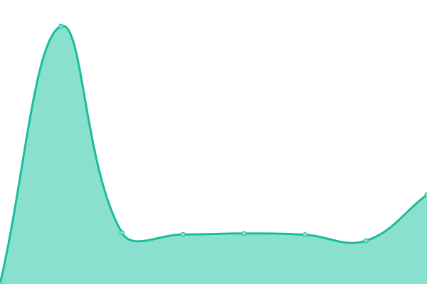

# [📈 Live Status](https://status.get6pm.com): <!--live status--> **🟧 Partial outage**

This repository contains the open-source uptime monitor and status page for [get6pm](https://status.get6pm.com), powered by [Upptime](https://github.com/upptime/upptime).

With [Upptime](https://upptime.js.org), you can get your own unlimited and free uptime monitor and status page, powered entirely by a GitHub repository. We use [Issues](https://github.com/get6pm/uptime/issues) as incident reports, [Actions](https://github.com/get6pm/uptime/actions) as uptime monitors, and [Pages](https://status.get6pm.com) for the status page.

<!--start: status pages-->
<!-- This summary is generated by Upptime (https://github.com/upptime/upptime) -->
<!-- Do not edit this manually, your changes will be overwritten -->
<!-- prettier-ignore -->
| URL | Status | History | Response Time | Uptime |
| --- | ------ | ------- | ------------- | ------ |
|  [API](https://api.get6pm.com/v1/health) | 🟩 Up | [api.yml](https://github.com/get6pm/uptime/commits/HEAD/history/api.yml) | 

 2040ms
     
 | 

<a href="https://status.get6pm.com/history/api">100.00%</a>
    

|  [CRM](https://20.rp.get6pm.com) | 🟥 Down | [crm.yml](https://github.com/get6pm/uptime/commits/HEAD/history/crm.yml) | 

 3909ms
     
 | 

<a href="https://status.get6pm.com/history/crm">0.00%</a>
    

|  [Private Docs](https://docs.rp.get6pm.com) | 🟥 Down | [private-docs.yml](https://github.com/get6pm/uptime/commits/HEAD/history/private-docs.yml) | 

 3798ms
     
 | 

<a href="https://status.get6pm.com/history/private-docs">0.00%</a>
    

<!--end: status pages-->

[**Visit our status website →**](https://status.get6pm.com)

## 📄 License

- Powered by: [Upptime](https://github.com/upptime/upptime)
- Code: [MIT](./LICENSE) © [Anand Chowdhary](https://anandchowdhary.com), supported by [Pabio](https://pabio.com)
- Data in the `./history` directory: [Open Database License](https://opendatacommons.org/licenses/odbl/1-0/)
